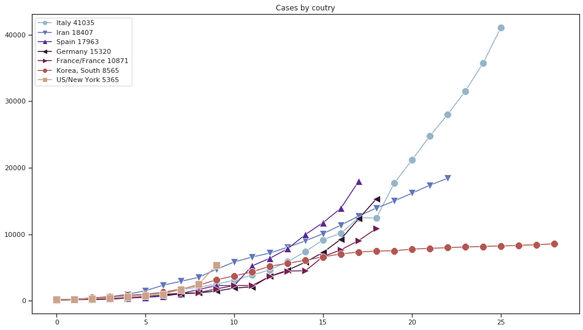
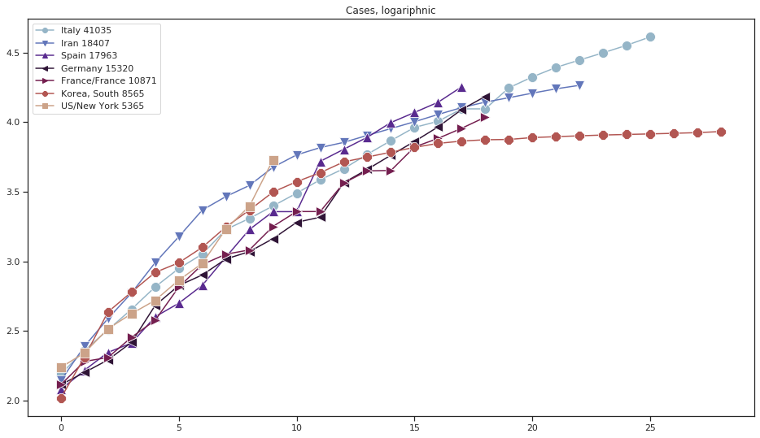

# Coronavirus progress by country

This is a Jupyter (lab) notebook

requires numpy, pandas, matplotlib, seaborn, io, ipympl
```
conda update conda
conda install numpy pandas matplotlib seaborn ipympl
```

It takes data from John Hopkins source 

https://github.com/CSSEGISandData/COVID-19/raw/master/csse_covid_19_data/csse_covid_19_time_series/time_series_19-covid-Confirmed.csv


and draws graph of the virus for each country with significant number of cases, starting from the day when number of cases became >100. China can be included or excluded, there is a variable for that. By default it's excluded as it is a special case.


As the regions are mostly in lockdown and there is no much cases transferred across the nations I kept Hopkins categorization by regions, so it will be (I hope not!) more US/\<state\> entries, not just one US


Produces pictures like those (For March 20 2020):







